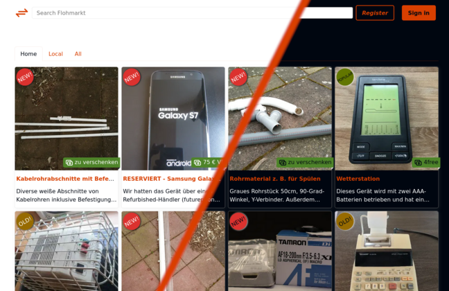

<!--
N.B.: This README was automatically generated by <https://github.com/YunoHost/apps/tree/master/tools/readme_generator>
It shall NOT be edited by hand.
-->

# flohmarkt for YunoHost

[](https://dash.yunohost.org/appci/app/flohmarkt)  

[](https://install-app.yunohost.org/?app=flohmarkt)

*[Read this README in other languages.](./ALL_README.md)*

> *This package allows you to install flohmarkt quickly and simply on a YunoHost server.*  
> *If you don't have YunoHost, please consult [the guide](https://yunohost.org/install) to learn how to install it.*

## Overview

## A decentral federated small advertisement platform

flohmarkt provides its own http server that can be used stand-alone to show small ads that registered users may publish. 

Registration works through the server itself and can be switched off (to run a server for e.g. only one person or only the persons that had been registered until that moment).

To register it's necessary to provide an email address to which a confirmation link is send.

Registered users can access a simple form to publish there small ads. The small ads can be looked at by anybody who is able to reach the website.

## Federation

To communicate with someone who published a small ad the server hints to an unregistred user _"To answer this offer please log in or create an account. OR use another fediverse-account"._

The small add visited turns out to be a _note_ in the fediverse. It's url can be opened with your favourite fediverse client at the server you're already registered to. You then can boost the small ad like any other note you read.

Or you can use your account to answer the author of the small ad if - and only if - you mark your note as 'private' aka 'direct'. This way you can contact the person.

It's also possible to follow accounts on flohmarkt servers like any other account in the fediverse to get new small ads published by that account in your timeline.

## Federation between flohmarkts

At time of installation the software asks for the coordinates of the community it should be for and the radius it should be used in.

This is an offer to help make the goods that might be offered travel less far. A flohmarkt can manually federate with other flohmarkts in its range showing all their goods on its page.

This is not ment to be a restriction, but a nudging to build local communities. These would have the advantage that people could trust each other more, because trades face-to-face could be more common.

## More information

Generally the [wiki](https://codeberg.org/flohmarkt/flohmarkt/wiki) is a good source of information.

* [presentation at ChaosCamp 2023](https://media.ccc.de/v/camp2023-57168-flohmarkt#l=eng&t=213)
* [list of known instances on the wiki](https://codeberg.org/flohmarkt/flohmarkt/wiki/flohmarkt-instances)
* [Service compatibility chart](https://codeberg.org/flohmarkt/flohmarkt/wiki/Service-compatibility-chart)


**Shipped version:** 0.0~ynh4

**Demo:** <https://flohmarkt.ween.de/>

## Screenshots



## Disclaimers / important information

## support

For questions about running flohmarkt on yunohost please use the [yunohost support matrix channel](https://yunohost.org/en/chat_rooms#help-and-support-chat-roo) or the [forum](https://forum.yunohost.org/t/ynh-flohmarkt-flohmarkt-as-an-app-for-yunohost/28455?u=chrichri).

To get help for **flohmarkt** itself please look at its [wiki](https://codeberg.org/flohmarkt/flohmarkt/wiki), [open an issue](https://codeberg.org/flohmarkt/flohmarkt/issues) with your request or join the [IRC channel flohmarkt](https://web.libera.chat/?nick=GithubGuest?#flohmarkt) on [libera.chat](https://libera.chat/).

## bugs, requesting features

Please use the issue tracker at https://codeberg.org/flohmarkt/flohmarkt_ynh/issues

## upstream repository

The yunohost integration of **flohmarkt** is developed by the flohmarkt organization on https://codeberg.org/ .

Please refer to https://codeberg.org/flohmarkt/flohmarkt_ynh/ to take part in development.

More about development of **flohmarkt**s yunohost integration can be found in [DEVELOPMENT.md](DEVELOPMENT.md)

## :red_circle: Antifeatures

- **Alpha software**: Early development stage. May contain changing or unstable features, bugs, and security vulnerability.
- **Arbitrary limitations**: Features arbitrary limitations. Please refer to the README.

## Documentation and resources

- Official app website: <https://codeberg.org/flohmarkt/flohmarkt>
- Official user documentation: <https://codeberg.org/flohmarkt/flohmarkt/wiki>
- Official admin documentation: <https://codeberg.org/flohmarkt/flohmarkt/wiki>
- Upstream app code repository: <https://codeberg.org/flohmarkt/flohmarkt>
- YunoHost Store: <https://apps.yunohost.org/app/flohmarkt>
- Report a bug: <https://github.com/YunoHost-Apps/flohmarkt_ynh/issues>

## Developer info

Please send your pull request to the [`testing` branch](https://github.com/YunoHost-Apps/flohmarkt_ynh/tree/testing).

To try the `testing` branch, please proceed like that:

```bash
sudo yunohost app install https://github.com/YunoHost-Apps/flohmarkt_ynh/tree/testing --debug
or
sudo yunohost app upgrade flohmarkt -u https://github.com/YunoHost-Apps/flohmarkt_ynh/tree/testing --debug
```

**More info regarding app packaging:** <https://yunohost.org/packaging_apps>
